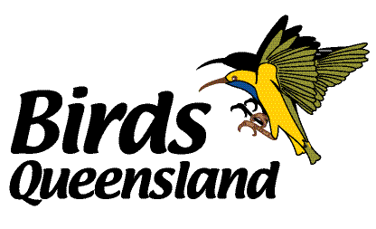

# Acknowledgements

The true heroes of the Atlas of the Birds of Brisbane are the 1,177 birdwatchers who have submitted their observations in Brisbane to eBird. As the _Atlas_ shows, the observations of so many people are very powerful when pooled together, and we sincerely thank each and every one of them for ensuring their records are accessible to all. Citizen science is helping us keep our finger on the pulse of Brisbane's birds, and this is a living atlas that continually updates to give the latest information about the distribution, abundance, status and trends of our avifauna. To join eBird today and start contributing your observations to the ABB, visit [ebird.org](https://ebird.org/home). There's no need to do anything special within eBird to make your records count - all eBird observations from Brisbane will automatically be pulled into the atlas.

The Atlas of the Birds of Brisbane project was initiated in 2018 with the help of a grant from [Birds Queensland](https://www.birdsqueensland.org.au/), which enabled the architecture of ABB to be established. Jeffrey Hanson at the [University of Queensland](https://www.uq.edu.au/) programmed the system, and an informal committee made some of the early decisions about the structure, purpose and remit of ABB. The committee comprises Louis Backstrom, Corey Callaghan, Richard Fuller, Mat Gilfedder, David Niland, Richard Noske, Chris Sanderson and Rochelle Steven. The committee welcomes anyone interested in helping out. Please contact [Richard Fuller](mailto:r.fuller@uq.edu.au).

Our deepest thanks to the wonderful community of Brisbane birders: Laura Aberdeen, Annie Abramovitz, Ben Abramovitz, Shem Abramovitz, Marleen Acton, R.J. Adams, Peter Adhemar, Christopher Ahlgren, Richard And Margaret Alcorn, Angelika Aleksieva, Callan Alexander, Hayley Alexander, Sylvia Alexander, Terence Alexander, James Allan, Andrew Allen, Jason Allen, Shelley Altman, Steve Altus, Bruna Amaral, Adam Andersen, Michael Andersen, Claire Anderson, Daniel Anderson, David Anderson, Jeffrey Anderson, Kitty Anderson, Matt Anderson, Sin Anderson, Glen Angus, Graeme Annable, Anne Anthony, Frank Antram, Loren Appleby, Rodney Appleby, Lili Aprende, Cassandra Arkinstall, Richard Armerding, Chris Armstrong, Doug Armstrong, John Armstrong, Thibaud Aronson, Louise Ashton, Chris Attewell, Dominic Auld, Sally Austin, Toby Austin, Bird Observers Club Of Australia, Birdlife Australia, Stephanie Avery-Gomm, Mark Ayers, Eve Bélisle, Louis Backstrom, Ian Bailey, Jaron Bailey, Helen Baines, Ian Baird, Tony Baker, Nick Baldwin, Nicola Baldwin, Marcia Balestri, Liam Ballard, Collin Banke, Ben Barkley, Chris Barnes, Chris Barnes, Megan Barnes, Shannon Barnes, Cara Barnhill, Plaxy Barratt, David Barton, Simon Barton, Cynthia Bassett, Kevin Bates, Ron Batie, Mikael Bauer, Matt Baumann, Tim Bawden, Lanaye Baxter, Roger Bazeu, Sue Beatty, Ry Beaver, Sarah Beavis, Feiyu2018 Beijing, Garrett Beisel, Neil Belling, Peter Bennet, Jacqui Bennett, Mark Bennett, Mike Bennett, Julie & Harald Berents, Josh Berman, Mike Bertram, Jane Beseda, Matthew Best, Gavin Bieber, Duan Biggs, Sandra Biggs, GNXSB BIGYEAR, Jez Bird, Tweety Bird, Tony Bischoff, David Bishop, Kathy Bissett, David Black, Glenda Black, Deborah Blackburn, Gary Bletsch, Troy Blodgett, Terry Blows, Jane Blumenthal, Alan Boardman, Di Boede, Bonnie Bompart, Nicholas Bond, Rebecca Bonebrake, Peter Bono, Peter Booth, Stephanie Borrelle, Jonathan Boucher, Tim Boucher, Paul Bourdin, Catherine Bourne, Leanne Bowden, Michael Bowen, Keith Bowers, Jenny Bowman, Wally Boydell, Barbara Bradford, DMT Braithwaite, Timothy Braithwaite, Julie Brake, Joost Brandsma, Dave Brine, Birdlife Brisbane South, Carole Bristow, Teale Britstra, Lucas Brook, Adrian Brooks, Paul Brooks, Tayler Brooks, Alexander Brown, Amanda Brown, Bill Brown, Chris Brown, Geoff Brown, Lynn Brown, Michael Brown, Sally Brown, Niel Bruce, Geraldine Buchanan, Gordon Buchanan, Mark Buckby, Seb Buckton, Gregory Budney, Vince Bugeja, Ian Bunce, Frank Burch, Samuel Burckhardt, Paul Burdett, Dylan Burford, Emma Burgess, Ian Burgess, Loren Burgess, Terry & Audrey Burgess, Chris Burns, Melissa Burrows, Todd Burrows, Chris Burwell, Antonia Burwell-Rodriguez, Robert Bush, Jim Butler, Mike Bysouth, Sandy C, Corey Callaghan, Ryu Callaway, Andrew Cameron, Thomas Campbell, Miquel Vall-Llosera Camps, Richard Cannings, Russell Cannings, Syd Cannings, Alexandra Canton, Duncan Cape, Mark Carey, Geoff Carpentier, Rita Carratello, John Carroll, J Castillon, Oxley Creek Catchment Association, Wolston And Centenary Catchments, Vince Cavalieri, Michel Cavigelli, Laura Chain, Felicia Chan, Philip Chaon, George Chapman, Lynn Chapman, S S Cheema, Ko Cheng, Rob Child, Michael Chirlin, Christian Cholette, Smathi Chong, Emilia Cipressi, Isaac Clarey, Katherine Clark, Margaret Clark, Rae Clark, Roger Clark, Steve Clark, Marcus Clarke, Alexandra Class Freeman, Luke Clemens, Robert Clemens, Paul R Clyne, Paul Coddington, Mich Coker, Peter Colasanti, Dan Coleman, John Collins, Frank Coman, Veronique Connolly, Sarah Converse, Melanie Cook, John Coons, Anna Cooper, Doug Cooper, Gerard Corkeron, William Cormack, Troy Corman, Will Cornwell, Paislie Corrigan, Amelie Corriveau, Tom Cotter, Jamie Cotton, Cate Cousland, Don Cowan, Ian Cowan, Jacqueline Craigie, Peter Crane, Alan Crawford, Matthew Crawford, Bill Crins, Taryn Crispin, Adam Cross, Gary Crouch, Peter Crow, Philip Crutchley, Ethan Culican, Jo Culican, Steve Cunningham, Cheryl And Paul Curran, Clive Curson, Brian Curtis, Thomas Czubek, Dale D, C Daley, Michael Daley, Gus Daly, Ruth Danella, Willie D'Anna, Mark Darter, Cameron Davidson, Max Davidson, Steve Davidson, Barry Davies, Ian Davies, Zack Davis, Bob Dawson, Sue Dawson, Susan Dawson, Anthony Day, Janine De La Begassiere, Eric De Leeuw, Barry Deacon, Lucas Decicco, Jamie Degenhardt, Geoffrey Dennis, John Dennison, Alix d'Entremont, Bruce Deuel, Kiran Dhanjal-Adams, Karen Dick, James Dickson, Jaana Dielenberg, Robert Dieterich, Lesley Dimmock, Nancy Auerbach And Dirk Hovorka, Paul & Ruth Dodd, Duncan Dodds, Michaela Doecke, Nat Doecke, Shaun Doecke, Sim Doecke, Alice Domalik, Craig Doolan, Michael Dorcas, Kathy Drake, Dylan Draper, Stephen Dray, Niels Poul Dreyer, Jacob Drucker, Chris Drysdale, Robyn Duff, Chris Dunford, Sandra Dunglison, Wendy Dunn, Peter Dunwiddie, Reba And Allan Dupilka, Bob Durant, Peter Dyson, Sarah Dzielski, Phil E, Sandra Eadie, Anthony Eales, Hedley & Irena Earl, Chris Earley, Scott Eaton, Daniel Eban, Cameron Eckert, Adam Edmonds, Leo Edson, Eddy Edwards, Robert Edwards, Darryl Eggins, Rowan Eisner, Thomas Ellaby, Linda Elling, Jon And Alison Elliott, Kyle Elliott, Glenda Ellis, Jesse Ellis, Stu Elsom, Erik Enbody, D England, Anne Sammis & Eric Gropp, Debra Erickson, Deena Errampalli, Rohan Etherington, Barry Evans, Craig Evenhouse, Len And Chris Ezzy, Stephen Falick, Chris Farmer, Linda Fearn, Pete Fenner, Alex Ferguson, Debra Ferguson, Elizabeth Ferguson, Patricia Ferguson, Mary Margaret Ferraro, Tim Field, Willy Finch, Marcel Finlay, Robbie Fischer, Grant Fisher, Ian Fisher, Keith & Lindsay Fisher, Glenda Fitzpatrick, Filthy Flockers, Stephanie Floyd, Carsten Fog, Deb Ford, Roger And Stephanie Ford, Alison Fox, Annette Foy, Margaret Francis-Cairns, Brenda Frank, Heidi Franklin, Rick Franks, Norbert Fratt, Ed Frazer, Benjamin Freeman, Paul Freeman, Bob French, Lila Fried, Richard Fried, Jude Friesen, Karo Fritzsche, Eric Froelich, Michael Fuhrer, Richard Fuller, Chris Funk, Matthew Gable, Ozzerina Gall, Sandra Gallienne, Eduardo Gallo, Frank Gallo, Rod Gardner, Kurt Gaskill, Stephen Gast, David Gatfield, Robert Gaucher, Donald Gaydon, Heath Gaydon, Jenny Gearheart, Matt Gearheart, Julie Geldard, Ken Gemell, Aristotle Georgiou, Myron Gerhard, Ian Gibson, Michelle Gibson, Seth Gibson, Julie Gidwitz, JB Gilet, Alexander Gilfedder, Barbara Gilfedder, Cathy Gilfedder, Mat Gilfedder, Brian Gill, Derryn Gill, Norton Gill, Roger Giller, Helen Gilliland, Karen Gillow, Scott Gilmore, Craig Gittleman, Charlene Glacy, Josh Glue, Diana Glynn, Gus Go, Doug Gochfeld, Jesse Golden, Hector Gomez De Silva, Patrik Good, David And Regan Goodyear, Gavin Goodyear, Meg Gordon, Liz Gould, Gerard Grady, Malcolm Graham, Joy Graydon, Jeff Grayum, Bruce Greatwich, Danny Green, Michael Green, Keith Gregoire, Samantha Greiner, Bob Gress, Vince Griesemer, Philip Griffin, Matteo Grilli, Steve Gross, SEQ Banding Group, Maggie Grundler, XUEYAN GUAN, Jenny Gursanscky, Daniel Guthrie, Alan Gutsell, Jess H, Stephen Haase, Nikolas Haass, Samantha Hagler, Beth Hall, Frank Hall, Richard Hall, Laurens Halsey, James Hamilton, Robert Hamilton, Carl Handreck, Bruce Hansen, Jorgen Hansen, Doug Harding, Benjamin Harms, Peter Harms, Graham Harrington, Ken Harris, Sarah Harris, Ian Hartley, Nige Hartley, Simon Harvey, David G Haskell, Tom Hatfield, Tanya Hattingh, Josh Hatton, Justine Hausheer, Curtis Hayne, Brian Healy, Torin Heavyside, James Hein, Pat Heirs, Mary Ann Henderson, Scott Henderson, Jono Henshaw, Kim Herbert, James Hermans, Diane Herron, Volker Hesse, Scott Hetherington, Ann Hewson, Roger Hicks, Mal & Gail Highgate Hill, George Hiley, Geoff Hill, Mark Hill, Matt Hinze, Catherine Hirsch, Xiaoru Hiu, Ofalia Ho, Tony Hoad, Michael Hoit, Shane Holborn, Matthew Holden, Steve Holliday, David Hollie, Rob Hollingworth, James Holmes, Zachery Holmes, David Holyoak, Wesley Homoya, Corinna Honscheid, Ian Hoppe, Peter Horler, Esther Horton, Renate Hottmann-Schaefer, Rick Houlk, Johnathan Hruska, Arco Huang, Pepsi Huang, Joanie & Mark Hubinger, Yu Hui-Jen, Neil Humphris, Eugene Hunn, Susan Hutson, Tania Ireton, David Irving, Lenn Isidore, Nigel Jackett, Micha Jackson, Fiona And Glynn Jackwitz, Rick & Leonie Jacobsen-Venroij, Jukka Jantunen, Andy Jensen, Mick Jerram, Sabine Jessen, Sheen Jin, Brian And Meg Johnson, Bruce Johnson, Peter Johnson, Tom Johnson, Alana Jones, Kendall Jones, Pedro Jordano, Tanja Jovic, Lesley Joyce, Emma June, Peter Kaestner, Andrea Kaim, Yuwaree Kamolsawat, Gary Kane, Julian Kapoor, Julie Karlson, Tim Kastelle, Monika Kaufman, Stephen Kearney, Arthur Keates, Sheryl Keates, Matthew Keefer, Charlie Keller, Steve Kelling, Stuart Kelly, Ruth Kemp, Jill Duncan & Ken Bissett, Tristan Kennedy, Simon Kennedy & Janina Jones, James Kennerley, Pippa Kern, Bernie Kester, Sarah Khalil, Anab Khan, Bashir Khan, Taro Kimimori, Bron & Daryl King, Jim Kirker, Al Kirkley, Travis Klein, Brendan Klick, Karen Kluge, Daniel Kluza, Richard Knapton, Alan Knue, Algirdas Knystautas, Heyn De Kock, Nicole Koeltzow, Rynhard Kok, Ko Konno, John Kooistra, Ron Kopitke, Heidi Krajewsky, Andrew Kratzing, Vernon Kretschmann, Susan Kruss, Eric Kuo, Peter Kyne, Arnaud Lacroix, John Lahey, Julien LAIGNEL, Stéphane Lair, Alison Lake, Russ Lamb, Geoff Larmour, Kim Larmour, Niels Larsen, Rita Larsen, Helen Larson, Peter Latta, Judith Lattaway, Andrew Lau, Henry Lau, Ben Lawson, Dwaine Laxdal, Elliot Leach, Gary Leavens, Janet Leavens, Daniel Lebbin, Jerry Ledbetter, Jasmine Lee, Sue Lee, Katie Lehman, Jason Leifester, Judy Leitch, Tim Lenz, Nick Leseberg, Stephanie Levins, Allen Lewis, Robert Lewis, Rebecca Lewison, Mark Ley, Ryan Leys, Tz-Yu Liao, David Lie, Jan Lile, Kurtis Lindsay, Charles Ling, Scott Linnane, Owen Lishmund, Michael Livingston, Michael Livingston, Megan Lloyd, Shawn Loewen, Brett Logan, Rohan Long, Meika Loofs Samorzewski, Mona Loofs-Samorzewski, Stephan Lorenz, Anne Love-Hoskins, Peter Lowe, Lan Lowson, Ben Lucking, Sarah Ludlow, Larisa Lumba, Ükos Lumnitzer, Jennifer Ma, Caroline Macdonald, Alan Maceachren, Jess Mackie, Michael Maggs, John Mahoney, Simon Mahood, Liam Manderson, Jannette And Peter Manins, Michelle & Curtis Manly, Doreen Mannion, Steve Mannix, Daniel Mantle, William Marengo, Emma Markwell, Philipp Marschlich, Matthew Marsh, David Marshall, Alister Martin, Anne Martin, Dave Martin, Jan And Larry Martin, Chris Martinez, Bob Martinka, Megan Massa, Tobin Master, Anna Matilda, Kelly Matthews, Golo Maurer, George Mayfield, Kris Mcbride, Steven Mcbride, Laura Mccallion, Tom Mccrie, Linda Mccutcheon, Davydd Mcdonald, Felicity Mcennulty, Catherine Mcfadden, Roger Mcglashan, Barb Mcgrenere, Mike Mcgrenere, Suzanne Mcgruer, Liam Mcguire, Don Mcivor, Mick Mckean, Grant Mckercher, Greg Mclachlan, Barry Mclean, Ian Mcmahon, Cameron Mcneill, Roger Mcneill, Barbara Meding, Clementine Menz, Thomas Merkling, Deb Merton, John Merton, Cecily Messer, Kurtis Messingale, Deborah Metters, Hal Michael, Robert Middelveld, Regina Migala, Allison Miller, Bill Miller, Richard Miller, Jonathan Mills-Anderson, Sam Mitcham, Kurt Mize, Ross Monks, Lynn Montville, Allen Moore, James Moore, Jim Moore, Richard Moore, Celeste Morien, Joseph Morlan, Craig Morley, Alan Morris, Keith Morris, Will Morris, Sue Moske, John Moss, More Mudflats, Nik Mulconray, Dale Mullin, Colin Mulvogue, Frank Murphy, Bill Murray, Dennis Murray, Stephen Murray, Karen Mustin, Tom Mutton, Jan Nargar, National Parks Association Of QLD, Andrew Naumann, Greg Neill, Brook Nelson, Del Nelson, Mary Ellen Newport, May-Le Ng, Vincent F. Nichnadowicz, Suzie Nicholls, Stuart Nicholson, Kevin Nick, Tim Nickholds, Sam Nicol, David Niland, Alison Nisbett, Ken Noble, Michael Noble, Raymond Nojek, Sean Nolan, Terrill Nordstrom, Ben Normark, Tim Norris, Marc Nortje, Richard Norton, Richard Noske, Debra Nowak, Tony Nowak, Micah Oberon, Mark O'Brien, Chris O'Bryan, Natalia Ocampo-Penuela, Barbara & Brian O'Connor, Damien O'Connor, Kennett Offill, James Ogilvie, Bernie Okeefe, Michael O'Keeffe, Jessie Oliver, Su Ping Ong, David Ongley, Margot Oorebeek, Doug Overacker, Karl Overman, Jeremy O'Wheel, Robin Oxley, Erkki Pöytäniemi, Amy Packer, Jay Packer, Diana Padron, Alysse Page, Tony Palliser, Catarina Palma, Nathan Palmer, Sebastian Pardo, Jack Parrington, Scott And Jenny Pascoe, Christophe PASQUIER, Cathy Pasterczyk, Judd Patterson, Craig Pattison, Frank Paul, Nicole Spillane And Paul Jacobson, Ian Peacock, Tommy Pedersen, Simon Peile, Wendy Penboss, Steve Percival, Danielle Perdaen, Carla Perkins, Alex Perlinski, Christian Perrin, Zachary Perry, Lance Peters, Cassandra Pettit, Elisha Pettit, Magen Pettit, Sigurdur Petursson, Daniel Phillips, Stuart Pickering, Matthew Pierce, Brendon Pike, Catherine Pillans, Jon Pleizier, Dan Poalillo, Kurt Pohlman, Pere Pons, Kaylene Poole, Richard Poort, Matt Pope, Stux Popp, Bill Popple, Lindsay Popple, Hugh Possingham, Mike Potter, Steve Potter, Rémy Poulin, Ilya Povalyaev, Barry And Alice Power, Mike Powers, Liam Pratt, Steven Pratt, Ivor Preston, Michael Preston, David Price, Samuel Price, Autumn Migration Project, Stephen Prowse, Richard Puddicombe, Keith Pyle, Suhel Quader, Birds Queensland, Natalie Quinn, Tom Quirk, John R, Sreekar Rachakonda, William Radke, Mary Rae, Nicolas Rakotopare, Daniel Raleigh, Michael Ramsey, Jason Ransom, Navin And Cherie Rao, Shoshana Rapley, Bruce Rasmussen, Terry Rau, Bobby Ray, Julia Ray, Deborah Read, Richard Read, Graichen & Recer, David Redhead, Jim Regali, Colin Reid, Sue Reid, Nancy Reilly, Margaret Reine, Mint Ren, Wolfe Repass, J W Rettig, Ivan And Sandra Reynolds, John Reynolds, John Rhule, Marc Ribaudo, Carol Lynn Richardson, Colin T. Richardson, Nicole Richardson, R. Bruce Richardson, Shane Richter, Edward Rickson, Rick Ridgeway, David J. Ringer, Jeremy Ringma, D J T Risson, Matthew Roach, Don Roberson, Allison Roberts, Greg Roberts, Tim And Marg Roberts, Margaret Robertson, David Robichaud, Mary Robichaud, Mike Robinson, Scott Robinson, Will Rodgers, Finn Roff-Marsh, Kit Roff-Marsh, Andrew Rogers, Daniel Rogers, Susan Rogers, Viv Rolland, Marion Roper, Karen Rose, Paul Rose, Sue Rose, Jan Roseneder, Terry Rosenmeier, Andrew Ross, Kevin Ross, Laurie Ross, Sonja Ross, Lee Rossow, James Rousseau, Jesse Rowland, Mike Rowlands, Ashwin Rudder, Linda Rudolph, Kelly Rueckheim, Claire Runge, David Russell, A John Ryan, Mary Anne Ryan, Rebecca Ryan, Scott Ryan, Thomas Ryan, Jennifer Rycenga, Jill Sadler, Katerina Sam, Ian Samson, Stephanie Samson, Chris Sanderson, Danika Sanderson, Erik Sandvig, Wangworn Sankamethawee, Julie Sarna, Megan Saunders, Raymonde Savoie, Peter Sawyer, Jim Scarff, M Scenko, Andrea Schafer, Mike Schanbacher, Sam Scheibel, Miles Scheuering, Kai Schraml, Debbie Schroeder, Scott Schuette, Wayne Schulz, Paul Scofield, Conor Scotland, Julie Scotland, David Seibel, Luke Seitz, John Sevenair, Gregg Severson, Danielle Shanahan, Brendan Sheean, Luke Shelley, Neil Shelley, ZHANG Shen, Dominic Sherony, Louise Sherratt, Albert Shultz, Kath Shurcliff, Grace Sibley, Christopher Siddle, Andrew Sides, Randall Siebert, Charles Silveira, Jeremy Simmonds, Joan And/Or George Sims, Alexander Skevington, Angela Skevington, Jeff Skevington, Richard Skevington, Aaron Skinner, Andrew Slater, Christopher Sloan, Karen Smallcombe, A Smith, Edward Smith, Graham Smith, Maria Smith, Milton Smith, Robyn Smith, Ross Smith, Toby Smith, Heather Smithers, Nicole Sommer, Roy Sonnenburg, Birdlife Southern Queensland, Lizabeth Southworth, Franziska Speck, Andrew Spencer, Lisa Spencer, Tim Spencer, Jeff Stacey, Mike Stake, Richard Staniforth, Claire Staples, Andrew Starrett, Emma Steele, Mel Stewart, Jenny Stiles, Derek Stokes, Vicki Stokes, Noah Strycker, Felipe Suarez, Brian Sullivan, John Sullivan, Colin Sumrall, David Sutton, Phil Swan, Holly Sweeney, Chris Symmons, Gilbert T, Nicholas Talbot, Mandy Talpas, Marie Tarrant, Tom Tarrant, Douglas Tate, Jim Tate, Paul Tavares, Andrew Taylor, Brett Taylor, David Taylor, Peter Taylor, Annette Teng, Andrew Thelander, Guy Thomas, Lee Thomas, Oscar Thomas, Nicolette Thompson, Simon Thompson, Stefan Thomsen, Simon Tickle, Peter Tierney, Gregor Tims, John Tollefson, Dirk Tomsa, John Toop, Dale Toweill, Daniel Townend, Ged Tranter, 2 Aussie Travellers, Mei-Hua Tsou, Tara Tuatai, Ayesha Tulloch, Viv Tulloch, Michael Tumpane, Jan Tunks, Becky Turley, Jane Turnbull, Ray Turnbull, Alison Turner, Beryl Turner, Paul Turner, Liao Tzu-Chiang, Peter Valentine, John Van Doorn, Rohan Van Twest, Jay Vandergaast, Eric Vanderwerf, George Vaughan, ANN VELKOVIC, Daniel Venema, Jaramar Villarreal Rosas, Mike Vincent, Melbie Visitor, Nigel Voaden, Mary-Anne Vos, Ronald Vyhmeister, Betty Walker, Delia Walker, Shealagh Walker, Sue Walsh, Calvin Walters, Lindsey Walters, Lee-Lien Wang, Michael Wanklin, George Warburton, Bruce Ward-Smith, Brad Warrick, Jacob Warrick, Brian Washburn, George Watola, Ann Watson, Chris Watson, James Watson, John Watson, Nathan Waugh, Rodney Webb, Jordan Webber, David Weber, Magill Weber, Patrick Webster, Bruce Wedderburn, Ben Weil, Karen Weil, Allan Welby, Joseph Welklin, Dezmond Wells, Joan Wharton, Stuart White, Brett Whitfield, Jack Whiting, Matthew And Nathan Whitty, Wendy Wilesmith, Chris Wiley, Kathy Wilk, Marit Wilkerson, Colin Williams, Dick Williams, Elizabeth Williams, Rzaria Williams, Michael Willis, Chris Wills, Angus Wilson, Erika M Wilson, Glenn Wilson, Jack Winterbottom, Scott Winton, Hans Wohlmuth, Andrew Wood, Mike Wood, Paul Wood, Leith Woodall, Peter Woodall, Russell Woodford, John Woods, Sam Woods, Brad Woodworth, Nick Worth, Duwayne Worthington, Holger Woyt, Matt Wright, Sue Wright, Tim Wunsch, Patrick Wyllie, Jeremy Wynne, Peter Wynne, Hou Xiaoru, Marie Yamamoto, Charice Yap, Catherine Yasuda, Sandy Yayanos, Russell Yong, Russell Qi Yung Yong, John York, Mark Young, Sara Young, Sue Young, Jane Younger, Gregory Zbitnew, Christina Zdenek, Marty Zelenietz, Jasmine Zeleny, Jinglan Zhang, Alex Zografos, and Stephanie Zonak.

This atlas is generously supported by [Birds Queensland](https://www.birdsqueensland.org.au/).

